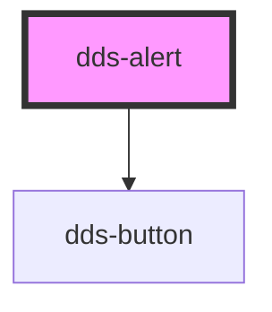

# dds-alert

<!-- Auto Generated Below -->

## Properties

| Property        | Attribute        | Description | Type                                          | Default       |
| --------------- | ---------------- | ----------- | --------------------------------------------- | ------------- |
| `alertTitle`    | `alert-title`    |             | `string`                                      | `''`          |
| `customClass`   | `custom-class`   |             | `string`                                      | `''`          |
| `description`   | `description`    |             | `string`                                      | `''`          |
| `primaryLink`   | `primary-link`   |             | `string`                                      | `undefined`   |
| `primaryText`   | `primary-text`   |             | `string`                                      | `'Primary'`   |
| `secondaryLink` | `secondary-link` |             | `string`                                      | `undefined`   |
| `secondaryText` | `secondary-text` |             | `string`                                      | `'Secondary'` |
| `type`          | `type`           |             | `"primary" \| "secondary"`                    | `'primary'`   |
| `variant`       | `variant`        |             | `"error" \| "info" \| "success" \| "warning"` | `'info'`      |

## Events

| Event        | Description | Type                |
| ------------ | ----------- | ------------------- |
| `closeEvent` |             | `CustomEvent<void>` |

## Dependencies

### Depends on

- [dds-button](../dds-button)

### Graph

----------------------------------------------

*Built with [StencilJS](https://stenciljs.com/)*
