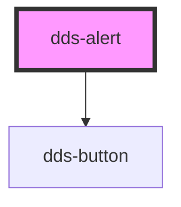

# dds-alert

<!-- Auto Generated Below -->

## Properties

| Property        | Attribute        | Description                                                                                                                                                                                                                                                                               | Type                                          | Default       |
| --------------- | ---------------- | ----------------------------------------------------------------------------------------------------------------------------------------------------------------------------------------------------------------------------------------------------------------------------------------- | --------------------------------------------- | ------------- |
| `alertTitle`    | `alert-title`    | The main heading text of the alert.                                                                                                                                                                                                                                                       | `string`                                      | `''`          |
| `customClass`   | `custom-class`   | Additional CSS class names to apply to the alert container. Multiple classes can be provided as a space-separated string.                                                                                                                                                                 | `string`                                      | `''`          |
| `description`   | `description`    | The detailed message text of the alert.                                                                                                                                                                                                                                                   | `string`                                      | `''`          |
| `primaryLink`   | `primary-link`   | URL for the primary action button. If provided, clicking the primary button will navigate to this URL.                                                                                                                                                                                    | `string`                                      | `undefined`   |
| `primaryText`   | `primary-text`   | Text label for the primary action button.                                                                                                                                                                                                                                                 | `string`                                      | `'Primary'`   |
| `secondaryLink` | `secondary-link` | URL for the secondary action button. If provided, clicking the secondary button will navigate to this URL.                                                                                                                                                                                | `string`                                      | `undefined`   |
| `secondaryText` | `secondary-text` | Text label for the secondary action button.                                                                                                                                                                                                                                               | `string`                                      | `'Secondary'` |
| `type`          | `type`           | The visual style type of the alert. 'primary' for stronger emphasis, 'secondary' for lighter emphasis.                                                                                                                                                                                    | `"primary" \| "secondary"`                    | `'primary'`   |
| `variant`       | `variant`        | The semantic variant of the alert that indicates its purpose. - 'info': For general information messages - 'warning': For warning messages that require attention - 'error': For error messages that indicate a problem - 'success': For success messages that confirm a positive outcome | `"error" \| "info" \| "success" \| "warning"` | `'info'`      |

## Events

| Event        | Description                                     | Type                |
| ------------ | ----------------------------------------------- | ------------------- |
| `closeEvent` | Event emitted when the close button is clicked. | `CustomEvent<void>` |

## Dependencies

### Depends on

- [dds-button](../dds-button)

### Graph

----------------------------------------------

*Built with [StencilJS](https://stenciljs.com/)*
