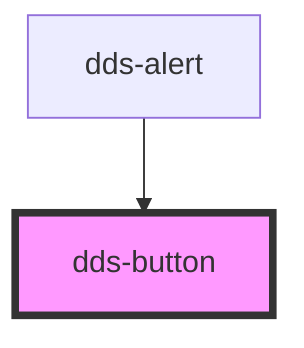

# dds-button

<!-- Auto Generated Below -->

## Properties

| Property     | Attribute    | Description                                                                                                          | Type                              | Default     |
| ------------ | ------------ | -------------------------------------------------------------------------------------------------------------------- | --------------------------------- | ----------- |
| `appearance` | `appearance` | The appearance style of the button. "solid" for filled background, "outline" for bordered style.                     | `"outline" \| "solid"`            | `'solid'`   |
| `compact`    | `compact`    | If true, displays the button in a compact size with reduced padding.                                                 | `boolean`                         | `false`     |
| `disabled`   | `disabled`   | Disable the button if true.                                                                                          | `boolean`                         | `false`     |
| `type`       | `type`       | Indicates the button's type. Equivalent to the native HTML button `type` attribute.                                  | `"button" \| "reset" \| "submit"` | `'button'`  |
| `variant`    | `variant`    | The visual variant for the button (emphasis level). "primary" for strong emphasis, "secondary" for lighter emphasis. | `"primary" \| "secondary"`        | `'primary'` |

## Events

| Event      | Description                                         | Type                      |
| ---------- | --------------------------------------------------- | ------------------------- |
| `ddsClick` | Fires when the button is clicked (if not disabled). | `CustomEvent<MouseEvent>` |

## Shadow Parts

| Part       | Description |
| ---------- | ----------- |
| `"button"` |             |

## Dependencies

### Used by

 - [dds-alert](../dds-alert)

### Graph

----------------------------------------------

*Built with [StencilJS](https://stenciljs.com/)*
